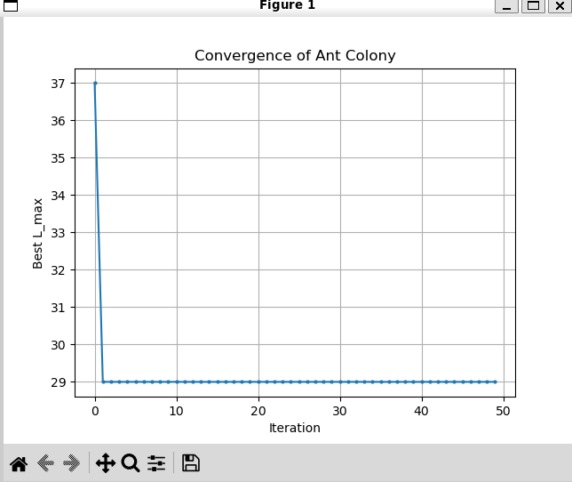
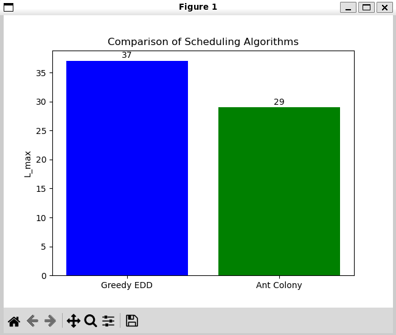

# Муравьиный алгоритм для планирования задач на одном процессоре (1|prec|Lmax)

Этот проект — моя реализация муравьиного алгоритма для задачи планирования с зависимостями и дедлайнами.  
Я прочитала статью о муравьином алгоритме для построения однопроцессорного расписания с минимизацией пикового использования ресурса и захотела разобраться в том, как работают муравьиные алгоритмы на более простой задаче. Вместо минимизации пиковой памяти я выбрала классическую цель — минимизацию максимального опоздания (Lmax) в системах реального времени.

## Задача

- **Вход**: ориентированный ациклический граф (DAG) задач, длительности, дедлайны.
- **Ограничение**: задачи выполняются на одном процессоре, порядок должен учитывать зависимости.
- **Цель**: найти расписание, минимизирующее максимальное опоздание Lmax = max(0, C_i - d_i).

Задача NP-трудна, поэтому используются эвристики. В проекте реализованы:
- Жадный алгоритм EDD (Earliest Due Date) с учётом зависимостей.
- Муравьиный алгоритм, вдохновлённый статьёй, где феромонная матрица отражает взаимный порядок любых двух задач.

## Как это работает

Муравьиный алгоритм строит расписание последовательно, на каждом шаге выбирая доступную задачу. Выбор зависит от:
- **Феромонной матрицы** (исторической информации): `tau[i][j]` показывает, насколько выгодно ставить i раньше j.
- **Эвристики**: `1 / due_date` (задачи с ранним дедлайном получают более высокий приоритет).

После каждой итерации лучший найденный маршрут усиливает феромонные следы.  
Алгоритм позволяет менять количество муравьёв, коэффициенты влияния феромона (α) и эвристики (β), скорость испарения (ρ) и начальный уровень феромона.

## Структура проекта

Проект состоит из нескольких файлов:

- `graph.py` — генерация случайного ациклического графа (DAG), длительностей задач и дедлайнов.
- `scheduler.py` — функции проверки допустимости расписания и расчёта Lmax.
- `greedy_edd.py` — реализация жадного алгоритма EDD с учётом зависимостей.
- `ant_colony.py` — класс, реализующий муравьиный алгоритм.
- `visualize.py` — построение графиков сходимости и сравнения алгоритмов.
- `main.py` — запуск экспериментов, вывод результатов, вызов визуализации.

Файлы связаны через импорты: `main.py` импортирует остальные модули и использует их функции/классы.

## Результаты

На случайных графах муравьиный алгоритм часто находит расписание на 10–50% лучше, чем жадный EDD.  
Пример работы (при фиксированном seed):  
Greedy L_max: 37  
Ant Colony L_max: 29  
Improvement: 21.62%  

  
   <em>Сходимость муравьиного алгоритма</em>

  

  
   <em>Сравнение двух алгоритмов</em>

